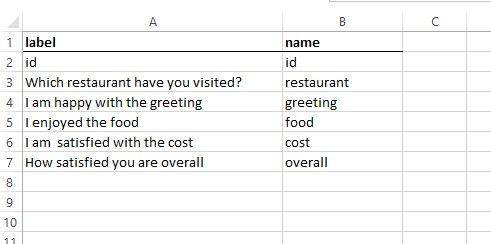

```{r setup, include=FALSE}
knitr::opts_chunk$set(echo = TRUE)
```


### The Libraries

```{r message=FALSE, warning=FALSE}
library(tidyverse)
library(labelled)
library(gtsummary)
library(readxl)
```


I usually work with survey data that come in the form of a spreadsheet (usually from google forms).

The variable names are long and highly descriptive of what information the variable contains, but that long of a name, makes it very hard to work with while wrangling the dataset.   

What I want is to keep the original variable name as a `label` and rename the variable names with new `names` 

To demontrate my workflow, I created a sample dataset to work with. You can download it [from github](https://github.com/lefkiospaikousis/distill_webpage/blob/master/_posts/2020-12-23-a-workflow-with-labelled-data/sample_survey.xlsx)

The dataset is stored as an excel file, and has two worksheets.  

- In the worksheet `data` you can see the raw data, and     
- In the worksheet `labels` you can find a sort of data dictionary

In the `labels` worksheet I keep a record of the original variable names as `label` and on the adjacent column,
I type a short but readable column `name` for the variable.



### Read the data and data-dictionary

Let's read in the data


```{r}

path = here::here("Data", "sample_survey.xlsx")
dta <- readxl::read_xlsx(path)

glimpse(dta)
```

The dataset contains 6 columns

Read in the `labels` worksheet for the column dictionary

```{r}
dta_labels <- readxl::read_xlsx(path, sheet = "labels")

dta_labels
```


Now, 

- Change the column names of the dataset to the short names in the dictionary    
- Set the `labels` of the columns via the `labelled::var_label()` function
- Create a `label_list` object, which is a named list where the names of the list are variable `names` and the values of the list are the variable `labels`
- Also, save a `label_vector` named vector with the same informationas the `label_list`

```{r}
names(dta) <- dta_labels$name

var_label(dta) <- dta_labels$label

labels_list <- var_label(dta)
labels_vector <-  var_label(dta, unlist = TRUE)

labels_list
```

Have a look at the dataset names now

```{r}
glimpse(dta)
```

Now its very easy to keep using the variable names in your code, but variable labels are rendered in the tables
when using `{gtsummary}` for example.

```{r}
dta %>%
  select(overall,restaurant) %>% 
  tbl_summary(
    by  = restaurant
  ) 
```


### Factors and order of the value labels

The order of the satifaction levels in the previous table, is not the most appropriate. It should read from `Very dissatisfied` down to `Very satisfied`.    
One way to accomplish this is to turn the variable into a factor. However, one problem arises now, where the `label` for the `overall` variable is gone. That is an inherent behaviour of `dplyr::mutate()` where it removes these attributes off of the variables that you manipulate.

See the `overall` title in the table below    

```{r}

# change `overall` to factor
dta <- 
  dta %>%
  mutate(
    overall  =  factor(overall,levels  = c("Very dissatisfied", "Dissatisfied", "Neutral",
                                           "Satisfied","Very satisfied"))
  ) 

dta %>% 
  select(overall,restaurant) %>% 
  tbl_summary(
    by  = restaurant
  ) 
```


You can easily solve this, using the `labelled::set_variable_names()` function.  This function can be used in the `dplyr` chain since it takes a `data` argument.    
What you need to use is the `labels_list` we have saved before and pass it in the `.labels` argument of the `set_variable_names()`

```{r}

dta <- 
  dta %>%
  set_variable_labels(.labels=labels_list)  #After mutating, the label information of the `overall` variable is gone.

dta %>% 
  select(overall,restaurant) %>% 
  tbl_summary(
    by  = restaurant
  ) 

```      


Important to say that:    

- Using the `labels_list` object we do not worry about the order of the variables as the matchingis done on the names of the variables.    

- There is no problem if the data has __more__ variables than what the `labels_list` contains as long  as all the variables contained in the `labels_list` are also in the dataset we want to label


## Plots

### Axis titles

Here, we want to utilise the labels we stored on the `labels_list` when defining axes title labels.

Here is the plot with the default varible names as the xes title labels

```{r}
plot_overall <- 
  dta %>%
  count(overall) %>% 
  ggplot(aes(overall, n))+
  geom_col()+
  coord_flip()

plot_overall
```

Now, you don;t need to type in manually the axis title label. Just use the `labels_list`
```{r}

plot_overall  +
  labs(x=labels_list[["overall"]])

```


### Facet strip labels

Here, we will utilise the `labels_vector` to show descriptive labels in the `facet_warp` strip texts


Usually, with these kind of questions(a series of likert scale questions), I want to plot many questions at the same plot. One way to do this is by tranforming all the data into a long format and  get the counts (or proportions) of ech response to each question in a long table. Then we plot it by faceting the graph by the question.

```{r}

faceted_plot <- 
  dta %>%
  select(greeting, food, cost) %>% 
  pivot_longer(everything(), 
               names_to = "attribute",
               values_to= "rating") %>% 
  count(attribute,  rating) %>% 
  mutate(
    rating = factor(rating, c("Strongly agree", "Agree", "Neutral", "Disagree", "Strongly disagree"))
  ) %>% 
  ggplot(aes(rating, n))+
  geom_col()+
  coord_flip()+
  facet_wrap(~attribute)

faceted_plot
```


When using facet wrap in `ggplots` we get the values of the facet column in the strip text. However, since the
facet column is actually a column that holds the question, it would be great to have the long label in the facet strip instead of the short name. 

Thankfully we don't have to do this manually. We can utilise the `label_vector` we saved earlier, and the underated ggplot function `as_labeller` (or sometimes the `labeller` function).You can read more about  [as_labeller](https://ggplot2.tidyverse.org/reference/as_labeller.html) and  [labeller](https://ggplot2.tidyverse.org/reference/labeller.html) for many more (and more usufull) use cases.


```{r}


faceted_plot+
  facet_wrap(~attribute,labeller = as_labeller(labels_vector))

```


###  Axis text labels


Here we will change how the levels in the axis ticks are displayed.

Im my workflow, very often I need to plot proportions (or other summary statistic) of many items in the survey. Let's assume we need to plot the proportion of respondents who answered positively ie.. `Strongly agree` or `Agree` in the rating questions `greeting`, `food` and `cost`.

One way of doing this: 

-1. Gather all rating questions (lets call them `attributes`) into a long format table with 2 columns - `attribute` and the `rating` for that attribute.
-2. Indicate if the rating is positive ie. `Agree/ Strongly agree` 
-3. Count tne occurrences of positive rating
 

```{r}

# Table of good rating percentages

tbl_pct <- 
  dta %>% 
  select(greeting, food, cost) %>% 
  # step 1
  pivot_longer(everything(), 
               names_to = "attribute",
               values_to= "rating") %>% 
  # 2. If Agree/strongly agree then `1` or `0`
  mutate(rating  =  if_else(rating %in% c("Agree","Strongly agree"),1,  0)) %>% 
  # 3.Count the occurrences andget proportion
  count(attribute, rating) %>% 
  group_by(attribute) %>% 
  mutate(pct = n/ sum(n)) 

#the plot
plot_pct <- 
  tbl_pct %>% 
  # keep only the `1`s i.e. the proportion of agree/sstrongly agree
  filter(rating ==1) %>% 
  ggplot(aes(attribute, pct))+
  geom_col()

plot_pct
```

Now, we need to change the `cost`, `food` and `greeting` with appropriate text

I usually use the `scale_*_discrete` function. There you can define the `labels` as a named list or a named vector

```{r}
plot_pct+
  scale_x_discrete(labels = labels_list) # or labels_vector. Both will work
```
